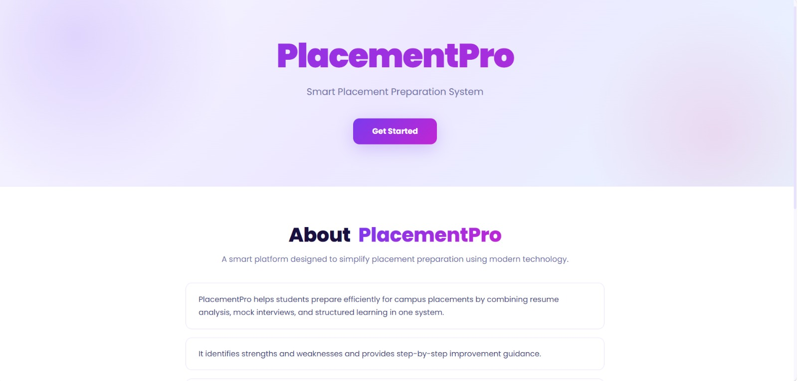

# 🚀 PlaceMentor - Smart Placement Preparation System

A modern React-based web application designed to help students prepare effectively for campus placements. It provides structured learning, mock interviews, resume analysis, and performance tracking in one platform.

---

## 📸 Screenshots

### 🏠 Home Page

## 📌 Project Overview

PlaceMentor is a smart placement preparation system that helps students:

* 📘 Prepare for aptitude, coding & interviews
* 🎯 Practice real interview scenarios
* 📊 Track performance and progress
* 🧠 Identify strengths & weaknesses
* 📄 Improve resumes with smart suggestions

---

## 🛠️ Tech Stack

* ⚛️ React.js (Vite)
* 🎨 CSS (Custom Styling)
* 🔁 React Router DOM (Navigation)
* 🧠 useState Hook (State Management)

---

## 🔑 Features

### 🏠 Home Page

* Attractive Hero Section
* About PlaceMentor
* Key Features Section

### 🔐 Login & Signup

* Form Validation
* Error Handling
* Controlled Components
* Toggle between Login & Signup
* Redirect to Dashboard after Login

### 📊 Dashboard

* Central hub for all features

### 📚 Placement Modules

* Mock Interview
* Resume Analyzer
* Progress Tracker
* Company Questions

---

## ⚙️ Installation & Setup

1️⃣ Clone the repository
git clone https://github.com/vaibhavwarade815/mentor-place-react-project-icp13.git

2️⃣ Go to project folder
cd placementor

3️⃣ Install dependencies
npm install

4️⃣ Run the project
npm run dev

5️⃣ Open in browser
http://localhost:5173

---

## Live Demo

👉

## 🧠 React Concepts Used

* Functional Components
* JSX
* useState Hook
* Event Handling
* Controlled Forms
* Form Validation
* Conditional Rendering
* React Router (Navigation)
* Dynamic Rendering using map()

---

## 🎯 Future Improvements

* Authentication with backend
* LocalStorage / JWT login system
* Protected Routes
* API Integration
* UI Enhancements

---

## 📸 Screenshots

* Home Page (Hero + About + Features)
* Login Page with Validation
* Dashboard

---

## 👨‍💻 Members

Developed as a group project by:

- Akshada Sanap
- Vaibhav Varade  
- Rinal Shinde 
- Dipti Bhawar
- Natasha Chainani 
- Sneha More

---

## ⭐ Conclusion

PlaceMentor is a beginner-to-intermediate level React project that covers important concepts like routing, state management, form validation, and UI design, making it ideal for learning and placement preparation.

---

⭐ If you like this project, give it a star on GitHub!
